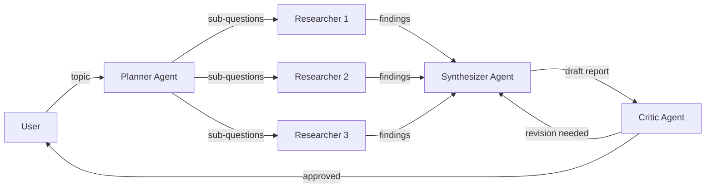

# 🔬 Deep Dive — Multi-Agent AI Research & Report Generation System

Deep Dive takes a research topic and produces a structured, cited report by coordinating four specialized AI agents that work together.

## Architecture



| Agent | Role | Model Provider |
|-------|------|----------------|
| **Planner** | Breaks topic into 3-5 sub-questions | Fireworks AI |
| **Researchers** | Parallel web research via Tavily | Fireworks AI |
| **Synthesizer** | Compiles cited report | Fireworks AI *or* AMD Cloud |
| **Critic** | Reviews for accuracy & gaps | Fireworks AI |

## Quick Start

### Prerequisites
- Docker & Docker Compose
- [Fireworks AI API Key](https://fireworks.ai/)
- [Tavily API Key](https://tavily.com/)

### 1. Clone & Configure

```bash
cd deep-dive
cp .env.example .env
# Edit .env and add your API keys:
#   FIREWORKS_API_KEY=your-key-here
#   TAVILY_API_KEY=your-key-here
```

### 2. Run with Docker

```bash
docker compose up --build
```

### 3. Open in Browser

Navigate to **http://localhost:8000** — enter a research topic and hit "Start Research".

## Local Development (without Docker)

### Backend

```bash
cd backend
python -m venv venv
venv\Scripts\activate        # Windows
# source venv/bin/activate   # macOS/Linux
pip install -r requirements.txt
cd ..
python -m uvicorn app.main:app --host 0.0.0.0 --port 8000 --reload --app-dir backend
```

### Frontend

The frontend is plain HTML/JS/CSS — no build step needed. It's served automatically by the FastAPI backend from the `frontend/` directory.

## Environment Variables

| Variable | Required | Default | Description |
|----------|----------|---------|-------------|
| `FIREWORKS_API_KEY` | ✅ | — | Fireworks AI API key |
| `TAVILY_API_KEY` | ✅ | — | Tavily search API key |
| `FIREWORKS_BASE_URL` | — | `https://api.fireworks.ai/inference/v1` | Fireworks API endpoint |
| `FIREWORKS_MODEL` | — | `accounts/fireworks/models/qwen2p5-72b-instruct` | Model ID for Fireworks |
| `SYNTHESIS_MODEL_PROVIDER` | — | `fireworks` | `fireworks` or `amd_cloud` |
| `AMD_CLOUD_BASE_URL` | — | — | vLLM endpoint URL |
| `AMD_CLOUD_API_KEY` | — | — | AMD Cloud API key |
| `AMD_CLOUD_MODEL` | — | — | Model name on vLLM |

## API

### `POST /research`

Accepts a JSON body and returns an SSE (Server-Sent Events) stream:

```bash
curl -X POST http://localhost:8000/research \
  -H "Content-Type: application/json" \
  -d '{"topic": "Impact of quantum computing on cryptography"}' \
  --no-buffer
```

**SSE Events:**

| Event | Description | Data |
|-------|-------------|------|
| `status` | Agent state change | `{agent, state, message, ...}` |
| `report` | Final report | `{markdown, providers}` |
| `error` | Error occurred | `{message}` |
| `done` | Stream complete | `{status: "complete"}` |

### `GET /health`

Health check endpoint.

---

## Switching Synthesis Agent to AMD Developer Cloud

To route the Synthesis Agent through a self-hosted vLLM endpoint running on an AMD MI300X instance:

### 1. Deploy a vLLM endpoint on AMD Developer Cloud

Set up a vLLM server on your MI300X instance. For example, with Llama-3.1-70B:

```bash
# On your MI300X instance:
python -m vllm.entrypoints.openai.api_server \
  --model meta-llama/Llama-3.1-70B-Instruct \
  --host 0.0.0.0 \
  --port 8000 \
  --tensor-parallel-size 4
```

### 2. Update your `.env`

```env
# Switch the synthesis agent to AMD Cloud
SYNTHESIS_MODEL_PROVIDER=amd_cloud

# Point to your MI300X vLLM endpoint
AMD_CLOUD_BASE_URL=http://your-mi300x-ip:8000/v1
AMD_CLOUD_API_KEY=token-abc123     # or "EMPTY" if no auth
AMD_CLOUD_MODEL=meta-llama/Llama-3.1-70B-Instruct
```

### 3. Restart

```bash
docker compose down && docker compose up --build
```

The Synthesis Agent will now use your MI300X-hosted model, while all other agents continue using Fireworks AI. The frontend badges will show "AMD Cloud" for the Synthesizer.

### Why only the Synthesis Agent?

The Synthesis Agent is the most compute-intensive — it processes all research findings and generates the full report. Running it on a dedicated MI300X instance demonstrates AMD's inference capabilities. The other agents (Planner, Researchers, Critic) have lighter workloads and can stay on Fireworks.

---

## Project Structure

```
deep-dive/
├── backend/
│   ├── app/
│   │   ├── __init__.py
│   │   ├── main.py              # FastAPI + SSE endpoint
│   │   ├── config.py            # Environment config & LLM factories
│   │   ├── pipeline.py          # Pipeline orchestration
│   │   └── agents/
│   │       ├── __init__.py
│   │       ├── planner.py       # Planner agent
│   │       ├── researcher.py    # Researcher agent
│   │       ├── synthesizer.py   # Synthesizer agent
│   │       └── critic.py        # Critic agent
│   └── requirements.txt
├── frontend/
│   ├── index.html
│   ├── style.css
│   └── app.js
├── Dockerfile
├── docker-compose.yml
├── .env.example
└── README.md
```

## Tech Stack

- **Orchestration**: [CrewAI](https://crewai.com/) v1.15+
- **Inference**: [Fireworks AI](https://fireworks.ai/) (Qwen 2.5 72B) / AMD Developer Cloud (vLLM)
- **Search**: [Tavily](https://tavily.com/)
- **Backend**: Python, FastAPI, SSE
- **Frontend**: HTML/JS/CSS (no build step)
- **Containerization**: Docker

## License

Built for the AMD AI Hackathon 2026.
