# Deep Dive — System Workflow

Here is the complete architectural workflow of how the Deep Dive multi-agent system processes a single research request from start to finish.

## System Architecture Diagram

```mermaid
sequenceDiagram
    participant User
    participant FastAPI (Backend)
    participant Planner Agent
    participant Researcher Agents (Parallel)
    participant Synthesizer Agent
    participant Critic Agent

    User->>FastAPI (Backend): Enter Topic & Click Start
    FastAPI (Backend)-->>User: Open SSE Connection (Streaming)
    
    rect rgb(30, 35, 45)
    Note over FastAPI (Backend), Critic Agent: Phase 1: Planning
    FastAPI (Backend)->>Planner Agent: Send Topic
    Planner Agent->>Planner Agent: Break topic into X sub-questions (based on Depth)
    Planner Agent-->>FastAPI (Backend): Return Sub-Questions
    FastAPI (Backend)-->>User: Stream UI Update (Planner Done)
    end

    rect rgb(20, 40, 50)
    Note over FastAPI (Backend), Critic Agent: Phase 2: Parallel Research
    FastAPI (Backend)->>Researcher Agents (Parallel): Assign 1 sub-question per agent
    
    par Agent 1
        Researcher Agents (Parallel)->>Researcher Agents (Parallel): Web Search + Summarize
    and Agent 2
        Researcher Agents (Parallel)->>Researcher Agents (Parallel): Web Search + Summarize
    and Agent N
        Researcher Agents (Parallel)->>Researcher Agents (Parallel): Web Search + Summarize
    end
    
    Researcher Agents (Parallel)-->>FastAPI (Backend): Return Raw Notes & Citations
    FastAPI (Backend)-->>User: Stream UI Update (Researchers Done)
    end

    rect rgb(40, 30, 50)
    Note over FastAPI (Backend), Critic Agent: Phase 3: Synthesis
    FastAPI (Backend)->>Synthesizer Agent: Send Raw Notes & Sub-questions
    Synthesizer Agent->>Synthesizer Agent: Write comprehensive Markdown report
    Synthesizer Agent-->>FastAPI (Backend): Return Draft Report
    FastAPI (Backend)-->>User: Stream UI Update (Synthesis Draft Done)
    end

    rect rgb(50, 30, 30)
    Note over FastAPI (Backend), Critic Agent: Phase 4: Critique & Revise Loop
    loop Max 2 Passes
        FastAPI (Backend)->>Critic Agent: Send Draft Report + Raw Notes
        Critic Agent->>Critic Agent: Verify facts, citations, and formatting
        
        alt Issues Found
            Critic Agent-->>FastAPI (Backend): Return Feedback
            FastAPI (Backend)-->>User: Stream UI Update (Revision Needed)
            FastAPI (Backend)->>Synthesizer Agent: Revise Report using Feedback
            Synthesizer Agent-->>FastAPI (Backend): Return Revised Draft
        else Perfect
            Critic Agent-->>FastAPI (Backend): Approve Report
        end
    end
    FastAPI (Backend)-->>User: Stream UI Update (Critic Done)
    end

    rect rgb(30, 45, 35)
    Note over FastAPI (Backend), Critic Agent: Phase 5: Delivery
    FastAPI (Backend)->>FastAPI (Backend): Save to SQLite Database
    FastAPI (Backend)-->>User: Stream Final Report Content
    User->>User: UI Triggers "Typing Effect"
    end
```

## Phase Breakdown

### 1. The Planner (The Architect)
When you submit a topic, the **Planner** goes first. It doesn't browse the web; instead, it uses its internal knowledge to break your broad topic down into highly specific, manageable sub-questions (2, 5, or 10 depending on the Depth slider you chose).

### 2. The Researchers (The Hive Mind)
The system spins up a swarm of parallel **Researcher** agents. Each agent is handed exactly one sub-question from the Planner. They independently scour the internet using the Tavily Search API, read articles, and compile raw, factual notes with citations. Because they run in parallel, 10 agents finish in the same time it takes 1 agent!

### 3. The Synthesizer (The Writer)
Once all the Researchers return with their notes, the **Synthesizer** takes over. It reads all the disjointed notes from the hive mind and stitches them together into a single, cohesive, beautifully formatted Markdown report with a logical flow.

### 4. The Critic (The Editor)
Before you see the final report, the **Critic** reads the Synthesizer's draft and compares it against the original Researcher notes. If the Critic finds missing citations, hallucinations, or poor formatting, it rejects the draft and forces the Synthesizer to rewrite it. It will do this up to 2 times to guarantee quality.

### 5. Delivery
Finally, the backend saves the perfect report to the SQLite database (so it appears in your history sidebar) and streams it back to your browser, where the JavaScript triggers the sleek typing animation!
